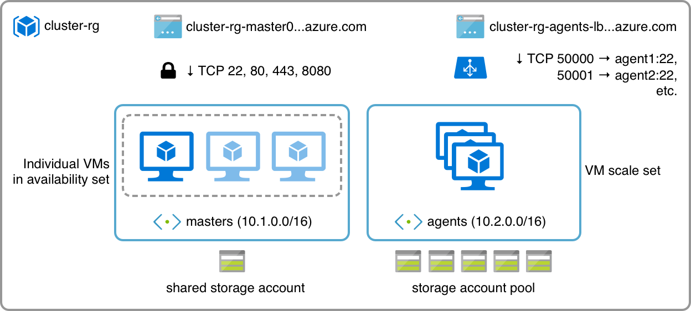

# azure-docker-swarm-cluster

A dynamically resizable Docker Swarm cluster for Azure. Watch the [Channel 9 video](https://channel9.msdn.com/Events/Journey-to-the-Websummit--Online-Masterclasses/Deploying-Rancher-on-Azure--Rui-Carmo-Microsoft-Services/Scaling-Docker-Swarms-on-Azure--Rui-Carmo-Microsoft) for a long(ish) demo that starts around the 30m mark, with an explanation of the Swarm cluster handling around the 1h mark.

## What

This is a barebones Azure Resource Manager template that automatically deploys a [Docker][d] Swarm cluster atop Ubuntu 18.04. This cluster has 1-5 master VMs and a VM scaleset for workers/agents, plus the required network infrastructure:

 

The template defaults to deploying B-Series VMs (`B1ls`) with the smallest possible managed disk size (S4, 32GB).

The key aspect of this template is that _you can add and remove agents at will_ simply by resizing the VM scaleset - the cluster comes with a few (very simple) helper scripts that allow nodes to join and leave the swarm as they are created/destroyed. 

## Why

This was originally built as [a barebones cluster template](http://taoofmac.com/space/blog/2016/08/07/2200) (for generic services that take advantage of dynamic scaling) and tweaked to show how to provision `cloud-init` scripts, VM scalesets and other ARM templating features.

## How

* `make keys` - generates an SSH key for provisioning
* `make params` - generates ARM template parameters
* `make deploy-cluster` - deploys cluster resources and pre-provisions Docker on all machines
* `make view-deployment` - view deployment progress
* `make deploy-monitor` - deploys a Swarm monitor container on `http://master0:8080`
* `make deploy-replicated-service` - deploys a simple web service onto the Swarm cluster (8 replicas)
* `make deploy-global-service` - deploys a simple web service onto the Swarm cluster (one container per node)
* `make scale-service-<number>` - scales the replicated service to `<number>` instances, i.e., `make scale-service-10` will resize it (up or down) to 10 containers
* `make deploy-stack` - deploys a simple Redis-backed stateful stack onto the Swarm cluster 
* `make list-agents` - lists all agent VMs
* `make scale-agents-<number>` - scales the agent VM scale set to `<number>` instances, i.e., `make scale-10` will resize it (up or down) to 10 VMs
* `make stop-agents` - stops all agents
* `make start-agents` - starts all agents
* `make reimage-agents-parallel` - nukes and paves all agents
* `make reimage-agents-serial` - reimages all agents in sequence
* `make chaos-monkey` - restarts all agents in random order
* `make proxy` - opens an SSH session to `master0` and sets up TCP forwarding to `localhost`
* `make tail-helper` - opens an SSH session to `master0` and tails the `swarm-helper` log
* `make list-endpoints` - list DNS aliases
* `make destroy-cluster` - destroys the entire cluster

## Recommended Sequence

    az login
    make keys
    make params
    make deploy-cluster
    make view-deployment
    # Go to the Azure portal and check the deployment progress
    
    # now deploy the Swarm monitor UI
    make deploy-monitor
    # Do a make endpoints to check the FQDNs and open a browser to the master FQDN, port 8080 to see the Swarm visualizer
    make endpoints
    
    # Now deploy the test service and watch as containers are loaded and run
    make deploy-replicated-service
    # Open the agent-lb endpoint in a browser, refresh to hit a different node (from outside Azure, Swarm is still quirky)
    make list-endpoints

    # Scale the service down
    make scale-service-4
    
    # Now scale the VM scale set and watch as new VMs join the cluster
    make scale-agents-7
    # Add more service workers, and watch them spread through the cluster
    make scale-service-16
    
    # Now scale down the VM scale set and watch Swarm coping by re-scheduling workers
    make scale-agents-3
     
    # Stop (but not de-allocate) worker VMs and watch all containers move to the master (because we have no scheduling rules)
    make stop-agents
    # Now re-start them
    make start-agents
    
    # Clean up after we're done working
    make destroy-cluster

## Requirements

* [Python][p]
* The new [Azure CLI][az] (`pip install -U -r requirements.txt` will install it)
* (Optional) `make` (you can just read through the `Makefile` and type the commands yourself)
* (Optional) a local Docker installation to rebuild the bundled test service (see the aptly named `test-service` folder)

## Changelog

* 2017-05-11: New ways to stress test the cluster, new stack for deployment
* 2017-04-29: Updated `cloud-init` files to install Docker CE from new official repository, renamed Makefile targets for agents
* 2017-02-28: Updated (and simplified) the template to support managed disks, added CPU-based autoscaling.
* Previously: Moved from `xplat-cli` to [Azure CLI][az], removed extraneous [Python][p] helpers.

## Internals

`master0` runs a very simple HTTP server (only accessible inside the cluster) that provides tokens for new VMs to join the swarm and an endpoint for them to signal that they're leaving. That server also cleans up the node table once agents are gone.

Upon provisioning, all agents try to obtain a worker token and join the swarm. Upon rebooting, they signal they're leaving the swarm and re-join it again.

This is done in the simplest possible way, by using `cloud-init` to bootstrap a few helper scripts that are invoked upon shutdown and (re)boot. Check the YAML files for details.

## Provisioning Flow

To avoid using VM extensions (which are nice, but opaque to most people used to using `cloud-init`) and to ensure each fresh deployment runs the latest Docker version, VMs are provisioned using `customData` in their respective ARM templates. 

`cloud-init` files and SSH keys are then packed into the JSON parameters file and submitted as a single provisioning transaction, and upon first boot Ubuntu takes the `cloud-init` file and provisions the machine accordingly.

If instantiation speed is a concern, this can be done once for each role and baked into a `.vhd` file - which then has to be pre-uploaded, and its location supplied to the cluster template. However, it might be much more efficient to just pause unneeded instances and restart them again when necessary.

## Improvements

There are several things that can be done to improve upon this:

* Use the instance metadata endpoint at http://169.254.169.254 to assess instance state
* Ensure this works with multiple masters (cursory testing suggests it works just fine, although it can be fiddly for agents to re-try connecting to up to 5 possible masters, etc.)
* Strengthen the token exchange mechanism (adding SSL and/or a shared `nonce` to the registration/draining URLs is left as an exercise to the reader)
* Find ways to nudge Swarm into re-balancing the load between nodes (there are already multiple approaches for this in the [Docker][d] issue list - (re)tagging might be the simplest)
* Stop instances and leave their resources allocated instead of destroying them completely upon rescaling, for faster scale-ups
* <strike>Turn on CPU-based auto-scaling in Azure (again, it's off largely because this is simpler to understand)</strike>

## Disclaimers

Keep in mind that this was written for conciseness and ease of understanding -- you can use this as the basis for rolling out a production environment, but _only_ after adding some error-checking.

The [Docker][d] way of achieving cluster self-provisioning relies on service-specific containers baked into their cloud images (and does not seem to allow for dynamically adding or removing nodes), so the approach in this repo is not canon - but it might be more interesting (and easier to expand upon) for people learning how to use [Docker][d] Swarm. 

Also, keep in mind that the load-balancer configuration does _not_ include TCP port probing or proactive failure detection.

[d]: http://docker.com
[p]: http://python.org
[dh]: https://hub.docker.com/r/rcarmo/demo-frontend-stateless/
[az]: https://github.com/Azure/azure-cli
